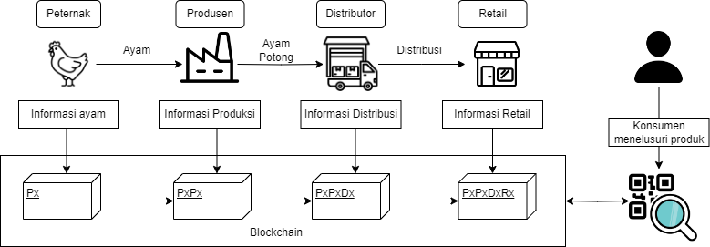
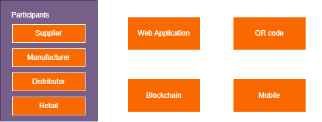

# Intro
Artikel ini membahas pembangunan teknologi blockchain pada rantai pasok makanan untuk memastikan keamanan dan kehalalan produk.

# Latar Belakang
Supply chain atau rantai pasok merupakan serangkaian proses dan kegiatan produksi mulai dari membuat bahan baku dari produsen, pengiriman oleh distributor kepada retail. hingga pembelian oleh konsumen. Supply chain management yang baik dapat meningkatkan proses produksi dengan efisien dan membuat keuntungan yang lebih besar. oleh karena itu, perlu diterapkan teknologi yang dapat membuat supply chain lebih aman dan transparan demi membuat produksi menjadi lebih baik. Hal ini dapat diterapkan menggunakan teknologi blockchain. 

Blockchain seperti buku besar terdistribusi yang catatannya tidak dapat diubah, dihapus maupun dimanipulasi. Informasi yang tersimpan dalam blockchain akan tersimpan secara permanen dengan keamanan tinggi. Karakteristik blockchain mencakup desentralisasi, transparansi, kredibilitas, transaksi yang dapat dilacak dan tidak dapat dipalsukan

# Branding
* Merk: BCSM(Block Chain Supply Management)
* Inspirasi merk: BlockChain Supply Chain
* Tagline: "Blockchain aman, Supply chain nyaman"
* Campaign: Bagaimana melacak dan memastikan supply chain yang aman
* Target user:
  * Usia 7+
  * Pengguna yang peduli akan kualitas, keamanan dan kehalalan makanan mereka
  * Perusahaan yang ingin memberikan kualitas yang terbaik bagi pengguna
* User Experience theme:
  * Antarmuka yang mudah digunakan dan dikonfigurasi
  * Terdapat qr code pada makanan yang dapat discan oleh handphone untuk kemudahan akses dan pemantauan
  * Memberikan informasi terperinci dan mudah dimengerti tentang produk yang diproses

# User Story
|         **Sebagai**        |                            **Saya ingin bisa**                            |                                            **Sehingga**                                           | **Prioritas** |
|:--------------------------:|:-------------------------------------------------------------------------:|:-------------------------------------------------------------------------------------------------:|:-------------:|
|     Sistem supply chain    |     Menyimpan informasi produk kedalam blockchain         |     Dapat menyimpan data produk secara aman                                                |     ⭐ ⭐ ⭐     |
|     Sistem supply chain    |     Memberikan informasi produk yang terdapat dalam blockchain                 |     Dapat memberikan informasi produk kepada pengguna                                           |     ⭐ ⭐ ⭐     |
|     Sistem supply chain    |     Mengubah status proses produk dalam supply chain        |     Pengguna dapat mengetahui sedang dalam proses mana    |     ⭐ ⭐ ⭐     |
|     Sistem supply chain              |       Memberikan kode qr produk            |     pengguna dapat mengakses data dalam blockchain menggunakan qr code                                             |     ⭐ ⭐      |

# Metode dan Algoritma
* Blockchain: Blockchain seperti buku besar terdistribusi yang catatannya tidak dapat diubah, dihapus maupun dimanipulasi.
  * Smart contract: digunakan untuk menulis aturan-aturan yang ada pada blockchain dan merekam semua transaksi yang terjadi pada sistem.
  * Solidity: Bahasa pemrograman yang digunakan untuk membuat smart contract.
  * Metamask: sebagai wallet digital yang digunakan untuk terhubung pada akun pengguna.
  * Testnet: jaringan development yang digunakan untuk percobaan transaksi
* Web Development: Menggunakan React js
* QR Code
# Flowchart

# Arsitektur Sistem

# Deskripsi Teknologi
* Blockchain: Blockchain seperti buku besar terdistribusi yang catatannya tidak dapat diubah, dihapus maupun dimanipulasi.
  * Smart Contract: Smart contract merupakan sebutan untuk kontrak yang terprogram dimana setiap perjanjian dicatat dalam kode komputer di Blockchain.
  * Solidity: Solidity adalah bahasa pemrograman open-source yang digunakan untuk membangun aplikasi pada platform blockchain Ethereum.
  * Metamask: MetaMask adalah sebuah dompet mata uang kripto yang digunakan untuk berinteraksi dengan rantai blok Ethereum. 
  * Ganache: Menyiapkan Ethereum Blockchain pribadi untuk menguji kontrak Soliditas Anda.
* Web Development:
  * React Js: React adalah libray JavaScript yang digunakan untuk membangun user interface yang interaktif berbasis component.

# User Experience (UX) Design
  * Antarmuka yang mudah digunakan dan dikonfigurasi
  * Terdapat qr code pada makanan yang dapat discan oleh handphone untuk kemudahan akses dan pemantauan
  * Memberikan informasi terperinci dan mudah dimengerti tentang produk yang sedang diproses
