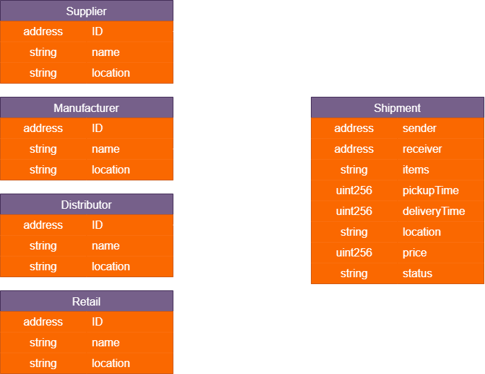
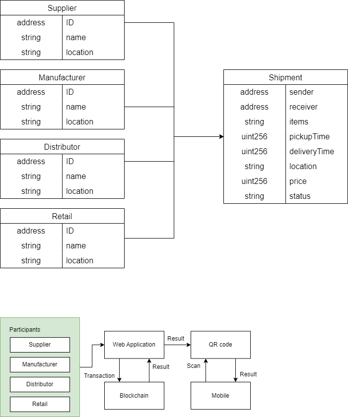

# Intro
Artikel ini membahas pembangunan teknologi blockchain pada rantai pasok makanan untuk memastikan keamanan dan kehalalan produk.

# Latar Belakang
Kehalalan makanan adalah suatu isu krusial yang memiliki dampak signifikan, terutama bagi masyarakat yang menjalankan keyakinan agama atau kepercayaan tertentu yang ketat dalam mengatur konsumsi makanan. Memastikan bahwa makanan yang dikonsumsi adalah benar-benar halal menjadi prinsip utama bagi banyak individu dan kelompok komunitas. Oleh karena itu, dalam rangka memenuhi tuntutan akan kepatuhan terhadap aturan kehalalan, terutama dalam industri makanan, diperlukan inovasi dalam mengawasi dan memastikan asal-usul makanan yang dikonsumsi.

Dalam upaya untuk meningkatkan transparansi dan keandalan dalam rantai pasokan makanan, teknologi blockchain telah muncul sebagai solusi yang sangat efektif. Blockchain adalah sebuah sistem terdesentralisasi yang mencatat transaksi secara digital dan aman, menciptakan jejak transparan dari setiap langkah dalam perjalanan makanan, mulai dari produksi hingga konsumsi akhir. Keunikan utama blockchain adalah ketidakmampuannya untuk mengubah atau memalsukan data yang sudah direkam, sehingga menciptakan sistem yang sangat andal dan terpercaya.

# Branding
* Merk: HalalCS
* Inspirasi merk: Halal supply chain,, merupakan rantai pasok makanan halal
* Tagline: "Makanan aman, pastikan halal"
* Campaign: Bagaimana melacak dan memastikan makanan yang dikonsumsi aman dan halal
* Target user:
  * Usia 7+
  * Pengguna yang peduli akan kualitas, keamanan dan kehalalan makanan mereka
  * Perusahaan yang ingin memberikan kualitas yang terbaik bagi pengguna
* User Experience theme:
  * Antarmuka yang mudah digunakan dan dikonfigurasi
  * Terdapat qr code pada makanan yang dapat discan oleh handphone untuk kemudahan akses dan pemantauan
  * Memberikan informasi terperinci dan mudah dimengerti tentang makanan yang dikonsumsi

# User Story
|         **Sebagai**        |                            **Saya ingin bisa**                            |                                            **Sehingga**                                           | **Prioritas** |
|:--------------------------:|:-------------------------------------------------------------------------:|:-------------------------------------------------------------------------------------------------:|:-------------:|
|     Sistem supply chain    |     Menyediakan   informasi terkait seluruh rantai pasok makanan          |     Dapat memberikan   transparansi rantai pasok                                                 |     ⭐ ⭐ ⭐     |
|     Sistem supply chain    |     Menyediakan   informasi rinci terkait produk makanan                  |     Dapat memberikan   informasi produk kepada pengguna                                           |     ⭐ ⭐ ⭐     |
|     Sistem supply chain    |     Memberikan kode QR   atau kode produk unik kepada pengguna            |     Pengguna dapat   melacak produk makanan dari asal-usulnya hingga sampai ke tangan pengguna    |     ⭐ ⭐       |
|     Sistem                 |     Menyimpan data   terkait produk makanan oleh produsen                 |     Data dapat tersimpan   dengan baik di blockchain                                              |     ⭐ ⭐ ⭐     |
|     Sistem                 |     Menyimpan data   informasi rinci terkait pengiriman produk makanan    |     Terdapat   transparansi dalam pengiriman dan keamanan                                         |     ⭐ ⭐ ⭐     |

# Metode dan Algoritma
* Blockchain:
  * Smart contract: digunakan untuk menulis aturan-aturan yang ada pada blockchain dan merekam semua transaksi yang terjadi pada sistem.
  * Solidity: Bahasa pemrograman yang digunakan untuk membuat smart contract.
  * Metamask: sebagai wallet digital yang digunakan untuk terhubung pada akun pengguna.
  * Testnet: jaringan development yang digunakan untuk percobaan transaksi
* Web Development: Menggunakan React js
* QR Code
# Struktur Data

# Arsitektur Sistem

# Deskripsi Teknologi
* Blockchain: blockchain adalah mekanisme basis data lanjutan yang memungkinkan berbagi informasi secara transparan dalam jaringan bisnis.
  * Smart Contract: Smart contract merupakan sebutan untuk kontrak yang terprogram dimana setiap perjanjian dicatat dalam kode komputer di Blockchain.
  * Solidity: Solidity adalah bahasa pemrograman open-source yang digunakan untuk membangun aplikasi pada platform blockchain Ethereum.
  * Metamask: MetaMask adalah sebuah dompet mata uang kripto yang digunakan untuk berinteraksi dengan rantai blok Ethereum. 
  * Testnet: Testnet merupakan wadah untuk eksperimen yang sekaligus bertujuan untuk meminimalkan risiko dampak uji coba terhadap keamanan jaringan.
* Web Development:
  * React Js: React adalah libray JavaScript yang digunakan untuk membangun user interface yang interaktif berbasis component.

# User Experience (UX) Design
