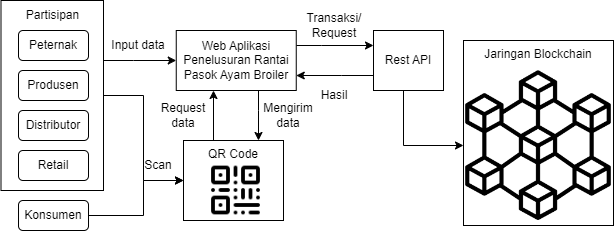

# Intro
Artikel ini membahas pembangunan teknologi blockchain pada rantai pasok makanan untuk memastikan keamanan dan kehalalan produk.

# Latar Belakang
* Fakta-fakta terkait masalah keracunan makanan atau penyakit yang disebabkan oleh makanan yang terkontaminasi
* Serta pemalsuan atau kecurangan produk makanan yang menjadikan makanan tidak aman dan halal
* Dibutuhkan transparansi rantai pasok makanan agar konsumen mengetahui asal-usul makanan, metode produksi dan perjalanan produk hingga sampai ke tangan mereka.

# Branding
* Merk: Mahal Chain
* Inspirasi merk: Mahal merupakan singkatan makanan halal, jadi aplikasi ini memastikan makanan halal menggunakan blockchain
* Tagline: "Makanan aman, pastikan halal"
* Campaign: Bagaimana melacak dan memastikan makanan yang dikonsumsi aman dan halal
* Target user:
  * Usia 7+
  * Pengguna yang peduli akan kualitas, keamanan dan kehalalan makanan mereka
  * Perusahaan yang ingin memberikan kualitas yang terbaik bagi pengguna
* User Experience theme:
  * Antarmuka yang mudah digunakan dan dikonfigurasi
  * Terdapat qr code pada makanan yang dapat discan oleh handphone untuk kemudahan akses dan pemantauan
  * Memberikan informasi terperinci dan mudah dimengerti tentang makanan yang dikonsumsi

# User Story
|         **Sebagai**        |                            **Saya ingin bisa**                            |                                            **Sehingga**                                           | **Prioritas** |
|:--------------------------:|:-------------------------------------------------------------------------:|:-------------------------------------------------------------------------------------------------:|:-------------:|
|     Sistem supply chain    |     Menyediakan   informasi terkait seluruh rantai pasok makanan          |     Dapat memberikan   transapatansi rantai pasok                                                 |     ⭐ ⭐ ⭐     |
|     Sistem supply chain    |     Menyediakan   informasi rinci terkait produk makanan                  |     Dapat memberikan   informasi produk kepada pengguna                                           |     ⭐ ⭐ ⭐     |
|     Sistem supply chain    |     Memberikan kode QR   atau kode produk unik kepada pengguna            |     Pengguna dapat   melacak produk makanan dari asal-usulnya hingga sampai ke tangan pengguna    |     ⭐ ⭐       |
|     Sistem                 |     Menyimpan data   terkait produk makanan oleh produsen                 |     Data dapat tersimpan   dengan baik di blockchain                                              |     ⭐ ⭐ ⭐     |
|     Sistem                 |     Menyimpan data   informasi rinci terkait pengiriman produk makanan    |     Terdapat   transparansi dalam pengiriman dan keamanan                                         |     ⭐ ⭐ ⭐     |

# Metode dan Algoritma
* Blockchain:
  * Smart contract: Solidity
  * Wallet: Metamask
  * Coin: Etherium testnet
* Web Development
  * React

# Struktur Data

# Arsitektur Sistem

# Deskripsi Teknologi

# User Experience (UX) Design
